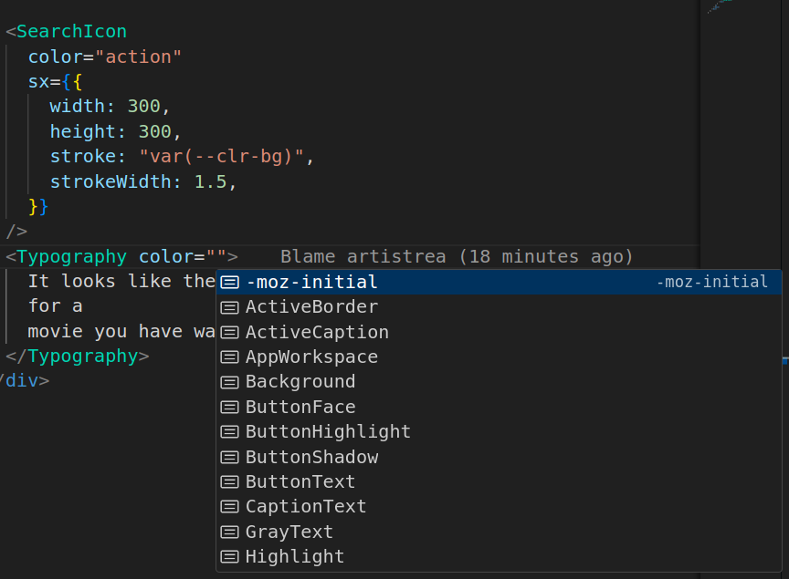

# Desafio Tarken

Considerando as instruções e requerimentos em inglês nos documentos `.docx`, separo as seguintes tarefas:

- [x] setup react frontend;
  - [x] rotas;
  - [x] componentes e páginas;
  - [x] definição de dependência do backend;
- [x] setup backend;
  - [x] modelagem inicial do banco de dados;
  - [x] rotas;
  - [ ] seed;
- [x] back: login e registro;
- [x] front: login e registro;
- [x] back: pesquisa no tmdb (adiciona ao bd "local" caso não tenha localmente);
- [x] front: pesquisa no tmdb (adiciona ao bd "local" caso não tenha localmente);
- [x] back: adição de um filme à biblioteca do usuário;
- [x] front: adição de um filme à biblioteca do usuário;
- [x] back: remoção de um filme da bilioteca de usuário;
- [x] front: remoção de um filme da bilioteca de usuário;

- [ ] setup react native mobile
- [ ] gravar áudio (guardar localmente enquanto não sincronizado com db)
- [ ] deletar áudio
- [ ] escutar áudio

- [ ] front: escutar o áudio gravado para um filme;

## Front end

Mínimo: Typescript, ReactJs, Material UI
Extra: TanStack router, TanStack/React Query, axios, js-cookie e Vite

## Backend

https://dbdiagram.io/d/656743c13be1495787fa3651

Mínimo: Typescript, NestJs, Rest, TypeORM, Postgres
Extra: class-validator, @nestjs/config (.env), @nestjs/jwt, bcrypt2

## Mobile

Typescript, React Native, React Native Paper, React Navigation

## Dúvidas/Dificuldades

MUI:

- Não encontrei como determinar tamanho do ícone deles (usaria lucide se não tivesse sido pedido MUI)
- Estou acostumado com tailwind, e MUI não é intuitivo para mim. O MUI parece que
  - tem componentes diferentes que, pelo nome, parecem a mesma coisa;
  - autocomplete nas propriedades dos componentes às vezes funciona e às vezes não;
  - a mesma propriedade em componentes diferentes aceita valores diferentes.

Um local no qual fiquei confuso:

Tem alguma maneira de olhar MUI, que eu não peguei, e que ajuda a entender? Senão, acho que essa é a minha parte mais fraca das tecnologias requeridas.

NestJS:

- Acessar `process.env` dentro de um `.module`:
  - Até vi que dá pra criar o próprio ConfigService e injetar no que precisar, mas não parecia tão simples então deixei de lado.
- Não sei como usar inferência de tipos em certas coisas:
  - Ao aplicar `AuthGuard` numa rota/controller, a propriedade current_user se é adicionada à requisição. Então eu tipei manualmente `req: AuthenticatedRequest`.
  - Tem como, nesse exemplo, fazer inferência de tipos ao invés de explicitá-los?
